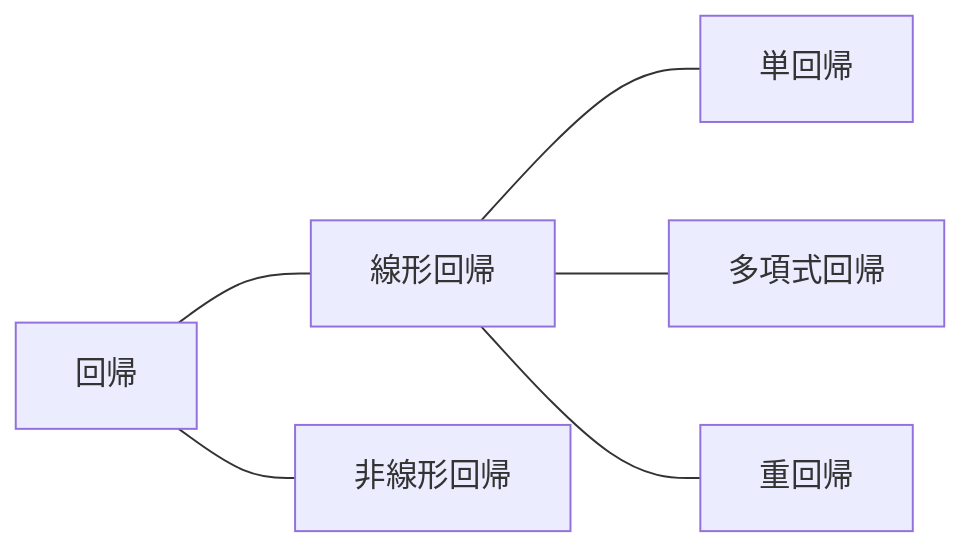

# 線形回帰について
## 回帰とは
あるデータ$`x`$,$`y`$において、$`y = f(x)`$という連続的なモデルを当てはめること。<br>
関数が線形なら線形回帰、線形でないなら非線形回帰と分類される<br>

線形回帰には、単回帰や多項式回帰、重回帰などの種類がある。<br>
上記の三つの違いは以下の通り。<br>

| 名前 | 説明 | 回帰の式 |
| ---- | ---- | ---- |
| 単回帰 | 変数が一種類で一次式 | $f(x) = ax + b$ |
| 多項式回帰 | 変数が一種類で多項式 | $f(x) = ax^3 + bx^2 + cx + d$ |
| 重回帰 | 変数が一杯 | $f(x) = ax + bu + cw + d$ |

以下、線形回帰のうち、単回帰と二変数の重回帰について解説する。<br>

## 単回帰(最小二乗法)
最小二乗法は単回帰を行うための**手法**の一つ<br>
データごとに二乗誤差を計算、その和(いわゆる誤差の二乗和)を誤差関数と定義して、
誤差関数が最小になるようにする。<br>
具体的には誤差関数を偏微分して、求める。<br>

$`n`$個のデータ$`(x_1,y_1),(x_2,y_2),...,(x_n,y_n)`$に対し、<br>
回帰式$`y(x) = ax + b`$に回帰する。<br>
$`i`$番目のデータと回帰式との誤差$`\varepsilon_i`$は<br>
```math
\varepsilon_i = y_i - (ax_i + b)
```
その二乗和(誤差関数)は<br>
```math
\displaystyle S=\sum^{n}_{i=1} {\varepsilon_i}^2=\sum^{n}_{i=1} \{y_i - (ax_i + b)\}^2
```
でなんやかんやすると、直接パラメータ$`a`$と$`b`$が出せる。<br>
```math
\left.
    \begin{matrix}
        a = \frac{
        \displaystyle \sum^{n}_{i=1} x_i \sum^{n}_{i=1} y_i - n\sum^{n}_{i=1} x_iy_i
        }
        {
            (\displaystyle \sum^{n}_{i=1} x_i)^2 - n\sum^{n}_{i=1} {x_i}^2
        } \cr
        b = \frac{
        \displaystyle \sum^{n}_{i=1} x_i\sum^{n}_{i=1} x_iy_i - \sum^{n}_{i=1} {x_i}^2 \sum^{n}_{i=1} y_i
        }
        {
            (\displaystyle \sum^{n}_{i=1} x_i)^2 - n\sum^{n}_{i=1} {x_i}^2
        }
    \end{matrix}
\right\}
```
これが最小二乗法による単回帰のやり方である。<br>

### 最小二乗法の導出
改めて二乗和(誤差関数)は<br>
```math
\displaystyle S=\sum^{n}_{i=1} {\varepsilon_i}^2=\sum^{n}_{i=1} \{y_i - (ax_i + b)\}^2
```
こいつをパラメータ$a,b$でそれぞれ偏微分すると<br>
```math
\displaystyle \frac{\partial S}{\partial a} = \sum^{n}_{i=1} 2\{y_i - (ax_i + b)\}(-x_i)=-2\sum^{n}_{i=1} x_i\{y_i - (ax_i + b)\}
```
```math
\displaystyle \frac{\partial S}{\partial b} = \sum^{n}_{i=1} 2\{y_i - (ax_i + b)\}(-1)=-2\sum^{n}_{i=1} \{y_i - (ax_i + b)\}
```
偏微分が0のとき、最小やろ！の精神(最適解に近づくとSは減少傾向)で連立すると<br>
```math
\left.
    \begin{matrix}
          \displaystyle -2\sum^{n}_{i=1} x_i\{y_i - (ax_i + b)\}=0 \cr
          \displaystyle -2\sum^{n}_{i=1} \{y_i - (ax_i + b)\}=0
    \end{matrix}
\right\}
```
上の式を整理していくｩ<br>
```math
\begin{aligned}
    \displaystyle -2\sum^{n}_{i=1} x_i\{y_i - (ax_i + b)\} &= 0 \cr
    \sum^{n}_{i=1} x_i\{y_i-(ax_i + b)\} &= 0 \cr
    \sum^{n}_{i=1} x_i(y_i - ax_i - b) &= 0 \cr
    \sum^{n}_{i=1} (x_iy_i - a{x_i}^2 - bx_i) &= 0 \cr
    \sum^{n}_{i=1} x_iy_i &= \sum^{n}_{i=1} (a{x_i}^2 + bx_i) \cr
    &= a \sum^{n}_{i=1} {x_i}^2 + b\sum^{n}_{i=1} {x_i}
\end{aligned}
```
下の式を整理していくｩ<br>
```math
\begin{aligned}
    \displaystyle -2 \sum^{n}_{i=1} \{y_i - (ax_i + b)\} &= 0 \cr
    \sum^{n}_{i=1} \{y_i - (ax_i + b)\} &= 0 \cr
    \sum^{n}_{i=1} (y_i - ax_i - b) &= 0 \cr
    \sum^{n}_{i=1} y_i &= \sum^{n}_{i=1} (ax_i + b) \cr
    &=  a\sum^{n}_{i=1} {x_i} + nb
\end{aligned}
```
ということで整理された連立方程式はこちら<br>
```math
\left.
    \begin{matrix}
        \displaystyle \sum^{n}_{i=1} x_iy_i = a\sum^{n}_{i=1} {x_i}^2 + b\sum^{n}_{i=1} {x_i} \cr
        \displaystyle \sum^{n}_{i=1} y_i = a\sum^{n}_{i=1} {x_i} + nb
    \end{matrix}
\right\}
```
下の式から$`b`$をもとめて<br>
```math
\displaystyle b = \frac{\displaystyle \sum^{n}_{i=1} y_i - a\sum^{n}_{i=1} {x_i}}{n}
```
上の式にぶち込む<br>
```math
\begin{aligned}
    \displaystyle \sum^{n}_{i=1} x_iy_i &= a\sum^{n}_{i=1} {x_i}^2 + \frac{
        \displaystyle \sum^{n}_{i=1} y_i - a\sum^{n}_{i=1} {x_i}
    }
    {
        n
    }
    \sum^{n}_{i=1} {x_i} \cr
    \sum^{n}_{i=1} x_iy_i &= a\sum^{n}_{i=1} {x_i}^2 + \frac{1}{n} \sum^{n}_{i=1} x_i \sum^{n}_{i=1} y_i - \frac{a}{n} (\sum^{n}_{i=1} x_i)^2 \cr
    n\sum^{n}_{i=1} x_iy_i &= an\sum^{n}_{i=1} {x_i}^2 + \sum^{n}_{i=1} x_i \sum^{n}_{i=1} y_i - a(\sum^{n}_{i=1} x_i)^2 \cr
    a(\sum^{n}_{i=1} x_i)^2 - an\sum^{n}_{i=1} {x_i}^2 &= \sum^{n}_{i=1} x_i \sum^{n}_{i=1} y_i - n\sum^{n}_{i=1} x_iy_i \cr
    a \{(\sum^{n}_{i=1} x_i)^2 - n\sum^{n}_{i=1} {x_i}^2\} &= \sum^{n}_{i=1} x_i \sum^{n}_{i=1} y_i - n\sum^{n}_{i=1} x_iy_i \cr
    a &= \frac{
        \displaystyle \sum^{n}_{i=1} x_i \sum^{n}_{i=1} y_i - n\sum^{n}_{i=1} x_iy_i
    }
    {
        (\displaystyle \sum^{n}_{i=1} x_i)^2 - n\sum^{n}_{i=1} {x_i}^2
    }
\end{aligned}
```
$`b`$の式にぶち込んで<br>

```math
\begin{aligned}
    b &= \frac{
        \displaystyle \sum^{n}_{i=1} y_i - \frac{
            \displaystyle \sum^{n}_{i=1} x_i \sum^{n}_{i=1} y_i - n\sum^{n}_{i=1} x_iy_i
        }
        {
            (\displaystyle \sum^{n}_{i=1} x_i)^2 - n\sum^{n}_{i=1} {x_i}^2
        }
         \sum^{n}_{i=1} {x_i}
    }
    {
        n
    } \cr
    b &= \frac{
        \displaystyle \sum^{n}_{i=1} y_i}
        {
            n}
     - \frac{
        \displaystyle \sum^{n}_{i=1} x_i \sum^{n}_{i=1} y_i - n\sum^{n}_{i=1} x_iy_i}
    {
        n\{(\displaystyle \sum^{n}_{i=1} x_i)^2 - n\sum^{n}_{i=1} {x_i}^2\}} 
    \sum^{n}_{i=1} {x_i} \cr
    b &= \frac{
    \displaystyle \sum^{n}_{i=1} y_i \{(\sum^{n}_{i=1} x_i)^2 - n\sum^{n}_{i=1} {x_i}^2 \} - (\sum^{n}_{i=1} x_i)^2 \sum^{n}_{i=1} y_i + n\sum^{n}_{i=1} x_i\sum^{n}_{i=1} x_iy_i 
    }
    {
        n\{(\displaystyle \sum^{n}_{i=1} x_i)^2 - n\sum^{n}_{i=1} {x_i}^2\}} \cr
    b &= \frac{
    \displaystyle (\sum^{n}_{i=1} x_i)^2\sum^{n}_{i=1} y_i - n\sum^{n}_{i=1} {x_i}^2 \sum^{n}_{i=1} y_i - (\sum^{n}_{i=1} x_i)^2 \sum^{n}_{i=1} y_i + n\sum^{n}_{i=1} x_i\sum^{n}_{i=1} x_iy_i
    }
    {
        n\{(\displaystyle \sum^{n}_{i=1} x_i)^2 - n\sum^{n}_{i=1} {x_i}^2\}
    } \cr
\end{aligned}
```
```math
\begin{aligned}
    b &= \frac{
        \displaystyle n\sum^{n}_{i=1} x_i\sum^{n}_{i=1} x_iy_i - n\sum^{n}_{i=1} {x_i}^2 \sum^{n}_{i=1} y_i
    }
    {
        n \{ \displaystyle ( \sum^{n}_{i=1} x_i)^2 - n\sum^{n}_{i=1} {x_i}^2\}
    } \cr
    b &= \frac{
        \displaystyle \sum^{n}_{i=1} x_i\sum^{n}_{i=1} x_iy_i - \sum^{n}_{i=1} {x_i}^2 \sum^{n}_{i=1} y_i
    }
    {
        (\displaystyle \sum^{n}_{i=1} x_i)^2 - n\sum^{n}_{i=1} {x_i}^2
    }
\end{aligned}
```

### 最小二乗法と統計学的指標との関係
分散公式は以下の通り<br>
```math
\displaystyle \sigma_x^2 = \bar{x^2} - \bar{x}^2 = \frac{1}{n} \sum^n_{i=1} {x_i}^2 - (\frac{1}{n} \sum^n_{i=1} x_i)^2
```
ただし$`\bar{x}`$は$`x`$の平均で、$`\bar{x^2}`$は$`x`$の二乗平均<br>
また共分散公式は以下の通り<br>
```math
\displaystyle \sigma_{xy} = \bar{xy} - \bar{x}\bar{y} = \frac{1}{n} \sum^n_{i=1} {x_i}{y_i} - (\frac{1}{n} \sum^n_{i=1} x_i)(\frac{1}{n} \sum^n_{i=1} y_i)
```
ただし$`\bar{x}`$は$`x`$の平均で、$`\bar{y}`$は$`y`$の平均、$`\bar{xy}`$は$`xy`$の平均<br>

**以上の公式を踏まえて**もっかい最小二乗法の$`a`$と$`b`$の式を見てみる。<br>
```math
\left.
    \begin{matrix}
        a = \frac{
            \displaystyle \sum^{n}_{i=1} x_i \sum^{n}_{i=1} y_i - n\sum^{n}_{i=1} x_iy_i
        }
        {
            (\displaystyle \sum^{n}_{i=1} x_i)^2 - n\sum^{n}_{i=1} {x_i}^2
        } \cr
        b = \frac{
            \displaystyle \sum^{n}_{i=1} x_i\sum^{n}_{i=1} x_iy_i - \sum^{n}_{i=1} {x_i}^2 \sum^{n}_{i=1} y_i
        }
        {
            (\displaystyle \sum^{n}_{i=1} x_i)^2 - n\sum^{n}_{i=1} {x_i}^2
        }
        = \frac{\displaystyle \sum^{n}_{i=1} y_i - a\sum^{n}_{i=1} {x_i}}{n}
    \end{matrix}
\right\}
```

**なんか似てね？**<br>
$`a`$について<br>
```math
\begin{aligned}
    a &= \frac{
        \displaystyle \sum^{n}_{i=1} x_i \sum^{n}_{i=1} y_i - n\sum^{n}_{i=1} x_iy_i
    }
    {
        (\displaystyle \sum^{n}_{i=1} x_i)^2 - n\sum^{n}_{i=1} {x_i}^2
    } \cr
    a &= \frac{
        \displaystyle \frac{1}{n}\sum^{n}_{i=1} x_i \frac{1}{n}\sum^{n}_{i=1} y_i - \frac{1}{n}\sum^{n}_{i=1} x_iy_i
    }
    {
        (\displaystyle \frac{1}{n}\sum^{n}_{i=1} x_i)^2 - \frac{1}{n}\sum^{n}_{i=1} {x_i}^2
    } \cr
    a &= \frac{
        \sigma_{xy}
    }
    {
        \sigma_x^2 
    } \cr
\end{aligned}
```
$`b`$について<br>
```math
\begin{aligned}
    b &= \frac{\displaystyle \sum^{n}_{i=1} y_i - a\sum^{n}_{i=1} {x_i}}{n} \cr
    &= \frac{1}{n}\sum^{n}_{i=1} y_i - a\frac{1}{n}\sum^{n}_{i=1} {x_i} \cr
    &= \bar{y} - \frac{\sigma_{xy}}{\sigma_x^2} \bar{x}
\end{aligned}
```
といった感じで、すっきりした見た目にすることができる。<br>

## 重回帰(最小二乗法の応用)

さっきまでやってた最小二乗法は一変数の回帰式だったけど<br>
重回帰は複数の変数に対して、おんなじことをやるぜ<br>

$`n`$個のデータ$`(x_1,w_1,y_1),(x_2,w_2,y_2),...,(x_n,w_n,y_n)`$に対し、<br>
今回は回帰式$`y=ax+bw+c`$に回帰する。変数は二つ。<br>
$`i`$番目のデータと回帰式との誤差$`\varepsilon_i`$は<br>
```math
\varepsilon_i = y_i - (ax_i + bw_i + c)
```
その二乗和(誤差関数)は<br>
```math
\displaystyle S=\sum^{n}_{i=1} {\varepsilon_i}^2=\sum^{n}_{i=1} \{y_i - (ax_i + bw_i + c)\}^2
```
でなんやかんやすると、直接パラメータ$`a`$、$`b`$と$`c`$が出せる。<br>


### 重回帰分析の導出
改めて二乗和(誤差関数)は<br>
```math
\displaystyle S=\sum^{n}_{i=1} {\varepsilon_i}^2=\sum^{n}_{i=1} \{y_i - (ax_i + bw_i + c)\}^2
```
こいつをパラメータ$`a,b,c`$でそれぞれ偏微分すると<br>
```math
\displaystyle \frac{\partial S}{\partial a} = \sum^{n}_{i=1} 2\{y_i - (ax_i + bw_i + c)\}(-x_i)=-2\sum^{n}_{i=1} x_i\{y_i - (ax_i + bw_i + c)\}
```
```math
\displaystyle \frac{\partial S}{\partial b} = \sum^{n}_{i=1} 2\{y_i - (ax_i + bw_i + c)\}(-w_i)=-2\sum^{n}_{i=1} w_i\{y_i - (ax_i + bw_i + c)\}
```
```math
\displaystyle \frac{\partial S}{\partial c} = \sum^{n}_{i=1} 2\{y_i - (ax_i + bw_i + c)\}(-1)=-2\sum^{n}_{i=1} \{y_i - (ax_i + bw_i + c)\}
```
偏微分が0のとき、最小やろ！の精神(最適解に近づくと$`S`$は減少傾向)で連立すると<br>
```math
\left.
    \begin{matrix}
          \displaystyle -2\sum^{n}_{i=1} x_i\{y_i - (ax_i + bw_i + c)\} = 0 \cr
          \displaystyle -2\sum^{n}_{i=1} w_i\{y_i - (ax_i + bw_i + c)\} = 0 \cr
          \displaystyle -2\sum^{n}_{i=1} \{y_i - (ax_i + bw_i + c)\} = 0
    \end{matrix}
\right\}
```
上の式を整理していくｩ<br>
```math
\begin{aligned}
    \displaystyle -2\sum^{n}_{i=1} x_i\{y_i - (ax_i + bw_i + c)\} &= 0 \cr
    \sum^{n}_{i=1} x_i\{y_i - (ax_i + bw_i + c)\} &= 0 \cr
    \sum^{n}_{i=1} x_i\{y_i - ax_i - bw_i - c\} &= 0 \cr
    \sum^{n}_{i=1} (x_iy_i - a{x_i}^2 - bw_ix_i - cx_i) &= 0 \cr
    \sum^{n}_{i=1} x_iy_i &= \sum^{n}_{i=1} (a{x_i}^2 + bw_ix_i + cx_i)\cr
    &= a\sum^{n}_{i=1} {x_i}^2 + b\sum^{n}_{i=1} w_ix_i + c\sum^{n}_{i=1} x_i
\end{aligned}
```
真ん中の式を整理していくｩ<br>
```math
\begin{aligned}
    \displaystyle -2\sum^{n}_{i=1} w_i\{y_i - (ax_i + bw_i + c)\} &= 0 \cr
    \sum^{n}_{i=1} w_i\{y_i - (ax_i + bw_i + c)\} &= 0 \cr
    \sum^{n}_{i=1} w_i\{y_i - ax_i - bw_i - c\} &= 0 \cr
    \sum^{n}_{i=1} (w_iy_i - aw_ix_i - b{w_i}^2 - cw_i) &= 0 \cr
    \sum^{n}_{i=1} w_iy_i &= \sum^{n}_{i=1} (aw_ix_i + b{w_i}^2 + cw_i) \cr
    &= a\sum^{n}_{i=1} w_ix_i + b\sum^{n}_{i=1} {w_i}^2 + c\sum^{n}_{i=1} w_i
\end{aligned}
```
下の式を整理していくｩ<br>
```math
\begin{aligned}
    \displaystyle -2\sum^{n}_{i=1} \{y_i - (ax_i + bw_i + c)\} &= 0 \cr
    \sum^{n}_{i=1} \{y_i - (ax_i + bw_i + c)\} &= 0 \cr
    \sum^{n}_{i=1} (y_i - ax_i - bw_i - c) &= 0 \cr
    \sum^{n}_{i=1} y_i &= \sum^{n}_{i=1} (ax_i + bw_i + c) \cr
    &= a\sum^{n}_{i=1} x_i + b\sum^{n}_{i=1} w_i + nc
\end{aligned}
```
ということで整理された連立方程式はこちら<br>
```math
\left.
    \begin{matrix}
        \displaystyle \sum^{n}_{i=1} x_iy_i = a\sum^{n}_{i=1} {x_i}^2 + b\sum^{n}_{i=1} w_ix_i + c\sum^{n}_{i=1} x_i \cr
        \displaystyle \sum^{n}_{i=1} w_iy_i = a\sum^{n}_{i=1} w_ix_i + b\sum^{n}_{i=1} {w_i}^2 + c\sum^{n}_{i=1} w_i \cr
        \displaystyle \sum^{n}_{i=1} y_i = a\sum^{n}_{i=1} x_i + b\sum^{n}_{i=1} w_i + nc
    \end{matrix}
\right\}
```
下の式から$`c`$をもとめて<br>
```math
c = \frac{\displaystyle \sum^{n}_{i=1} y_i - a\sum^{n}_{i=1} {x_i} - b\sum^{n}_{i=1} {w_i}}{n}
```
真ん中の式にぶち込んで$`b`$を求める<br>
```math
\begin{aligned}
    \displaystyle \sum^{n}_{i=1} w_iy_i &= a\sum^{n}_{i=1} w_ix_i + b\sum^{n}_{i=1} {w_i}^2 + (\frac{\displaystyle \sum^{n}_{i=1} y_i - a\sum^{n}_{i=1} {x_i} - b\sum^{n}_{i=1} {w_i}}{n})\sum^{n}_{i=1} w_i \cr
    \displaystyle \sum^{n}_{i=1} w_iy_i &= a\sum^{n}_{i=1} w_ix_i + b\sum^{n}_{i=1} {w_i}^2 + \frac{1}{n}\sum^{n}_{i=1} w_i\sum^{n}_{i=1} y_i - \frac{a}{n} \sum^{n}_{i=1} w_i\sum^{n}_{i=1} x_i - \frac{b}{n} (\sum^{n}_{i=1} w_i)^2 \cr
    \displaystyle b\{ \frac{1}{n} (\sum^{n}_{i=1} w_i)^2 - \sum^{n}_{i=1} {w_i}^2 \}&= (\frac{1}{n}\sum^{n}_{i=1} w_i\sum^{n}_{i=1} y_i - \sum^{n}_{i=1} w_iy_i) + a(\sum^{n}_{i=1} w_ix_i - \frac{1}{n} \sum^{n}_{i=1} w_i\sum^{n}_{i=1} x_i) \cr
    \displaystyle b &= \frac{
        (\displaystyle \frac{1}{n}\sum^{n}_{i=1} w_i\sum^{n}_{i=1} y_i - \sum^{n}_{i=1} w_iy_i) + a(\sum^{n}_{i=1} w_ix_i - \frac{1}{n} \sum^{n}_{i=1} w_i\sum^{n}_{i=1} x_i)
    }
    {
        \displaystyle \frac{1}{n} (\sum^{n}_{i=1} w_i)^2 - \sum^{n}_{i=1} {w_i}^2
    }
\end{aligned}
```
出来上がった$`b`$と$`c`$を一番上の式に代入する<br>
```math
\begin{aligned}
    \displaystyle \sum^{n}_{i=1} x_iy_i &= a\sum^{n}_{i=1} {x_i}^2 + b\sum^{n}_{i=1} w_ix_i + \frac{\displaystyle \sum^{n}_{i=1} y_i - a\sum^{n}_{i=1} {x_i} - b\sum^{n}_{i=1} {w_i}}{n}\sum^{n}_{i=1} x_i \cr
    \sum^{n}_{i=1} x_iy_i &= a\sum^{n}_{i=1} {x_i}^2 + b\sum^{n}_{i=1} w_ix_i + \frac{1}{n} \sum^{n}_{i=1} x_i\sum^{n}_{i=1} y_i - \frac{a}{n}(\sum^{n}_{i=1} {x_i})^2 - \frac{b}{n}\sum^{n}_{i=1} {w_i}\sum^{n}_{i=1} x_i \cr
    \sum^{n}_{i=1} x_iy_i &= \frac{1}{n} \sum^{n}_{i=1} x_i\sum^{n}_{i=1} y_i + a\{\sum^{n}_{i=1} {x_i}^2 - \frac{1}{n}(\sum^{n}_{i=1} {x_i})^2 \} + b(\sum^{n}_{i=1} w_ix_i - \frac{1}{n}\sum^{n}_{i=1} {w_i}\sum^{n}_{i=1} x_i)
\end{aligned}
```
```math
    \sum^{n}_{i=1} x_iy_i = \frac{1}{n} \sum^{n}_{i=1} x_i\sum^{n}_{i=1} y_i + a\{\sum^{n}_{i=1} {x_i}^2 - \frac{1}{n}(\sum^{n}_{i=1} {x_i})^2 \} + \frac{(\displaystyle \frac{1}{n}\sum^{n}_{i=1} w_i\sum^{n}_{i=1} y_i - \sum^{n}_{i=1} w_iy_i) + a(\sum^{n}_{i=1} w_ix_i - \frac{1}{n} \sum^{n}_{i=1} w_i\sum^{n}_{i=1} x_i)}{\displaystyle \frac{1}{n} (\sum^{n}_{i=1} w_i)^2 - \sum^{n}_{i=1} {w_i}^2}(\sum^{n}_{i=1} w_ix_i - \frac{1}{n}\sum^{n}_{i=1} {w_i}\sum^{n}_{i=1} x_i) 
```
```math
\sum^{n}_{i=1} x_iy_i = \frac{1}{n} \sum^{n}_{i=1} x_i\sum^{n}_{i=1} y_i + a\{\sum^{n}_{i=1} {x_i}^2 - \frac{1}{n}(\sum^{n}_{i=1} {x_i})^2 \} + \frac{(\displaystyle \frac{1}{n}\sum^{n}_{i=1} w_i\sum^{n}_{i=1} y_i - \sum^{n}_{i=1} w_iy_i) (\sum^{n}_{i=1} w_ix_i - \frac{1}{n}\sum^{n}_{i=1} {w_i}\sum^{n}_{i=1} x_i) }{\displaystyle \frac{1}{n} (\sum^{n}_{i=1} w_i)^2 - \sum^{n}_{i=1} {w_i}^2} + \frac{\displaystyle a(\sum^{n}_{i=1} w_ix_i - \frac{1}{n} \sum^{n}_{i=1} w_i\sum^{n}_{i=1} x_i)(\sum^{n}_{i=1} w_ix_i - \frac{1}{n}\sum^{n}_{i=1} {w_i}\sum^{n}_{i=1} x_i)}{\displaystyle \frac{1}{n} (\sum^{n}_{i=1} w_i)^2 - \sum^{n}_{i=1} {w_i}^2}
```
```math
\sum^{n}_{i=1} x_iy_i - \frac{1}{n} \sum^{n}_{i=1} x_i\sum^{n}_{i=1} y_i - \frac{(\displaystyle \frac{1}{n}\sum^{n}_{i=1} w_i\sum^{n}_{i=1} y_i - \sum^{n}_{i=1} w_iy_i) (\sum^{n}_{i=1} w_ix_i - \frac{1}{n}\sum^{n}_{i=1} {w_i}\sum^{n}_{i=1} x_i) }{\displaystyle \frac{1}{n} (\sum^{n}_{i=1} w_i)^2 - \sum^{n}_{i=1} {w_i}^2} = a\{\sum^{n}_{i=1} {x_i}^2 - \frac{1}{n}(\sum^{n}_{i=1} {x_i})^2 \} + \frac{\displaystyle a(\sum^{n}_{i=1} w_ix_i - \frac{1}{n} \sum^{n}_{i=1} w_i\sum^{n}_{i=1} x_i)(\sum^{n}_{i=1} w_ix_i - \frac{1}{n}\sum^{n}_{i=1} {w_i}\sum^{n}_{i=1} x_i)}{\displaystyle \frac{1}{n} (\sum^{n}_{i=1} w_i)^2 - \sum^{n}_{i=1} {w_i}^2}
```
```math
\frac{( \displaystyle \sum^{n}_{i=1} x_iy_i - \frac{1}{n} \sum^{n}_{i=1} x_i\sum^{n}_{i=1} y_i)( \frac{1}{n} (\sum^{n}_{i=1} w_i)^2 - \sum^{n}_{i=1} {w_i}^2)-(\displaystyle \frac{1}{n}\sum^{n}_{i=1} w_i\sum^{n}_{i=1} y_i - \sum^{n}_{i=1} w_iy_i) (\sum^{n}_{i=1} w_ix_i - \frac{1}{n}\sum^{n}_{i=1} {w_i}\sum^{n}_{i=1} x_i) }{\displaystyle \frac{1}{n} (\sum^{n}_{i=1} w_i)^2 - \sum^{n}_{i=1} {w_i}^2} = a \frac{\displaystyle (\sum^{n}_{i=1} {x_i}^2 - \frac{1}{n}(\sum^{n}_{i=1} {x_i})^2 )(\frac{1}{n} (\sum^{n}_{i=1} w_i)^2 - \sum^{n}_{i=1} {w_i}^2)+ (\sum^{n}_{i=1} w_ix_i - \frac{1}{n} \sum^{n}_{i=1} w_i\sum^{n}_{i=1} x_i)(\sum^{n}_{i=1} w_ix_i - \frac{1}{n}\sum^{n}_{i=1} {w_i}\sum^{n}_{i=1} x_i)}{\displaystyle \frac{1}{n} (\sum^{n}_{i=1} w_i)^2 - \sum^{n}_{i=1} {w_i}^2}
```
```math
    a = \frac{
    ( \displaystyle \sum^{n}_{i=1} x_iy_i - \frac{1}{n} \sum^{n}_{i=1} x_i\sum^{n}_{i=1} y_i)( \frac{1}{n} (\sum^{n}_{i=1} w_i)^2 - \sum^{n}_{i=1} {w_i}^2)-(\displaystyle \frac{1}{n}\sum^{n}_{i=1} w_i\sum^{n}_{i=1} y_i - \sum^{n}_{i=1} w_iy_i) (\sum^{n}_{i=1} w_ix_i - \frac{1}{n}\sum^{n}_{i=1} {w_i}\sum^{n}_{i=1} x_i)
    }
    {
    \displaystyle (\sum^{n}_{i=1} {x_i}^2 - \frac{1}{n}(\sum^{n}_{i=1} {x_i})^2 )(\frac{1}{n} (\sum^{n}_{i=1} w_i)^2 - \sum^{n}_{i=1} {w_i}^2)+ (\sum^{n}_{i=1} w_ix_i - \frac{1}{n} \sum^{n}_{i=1} w_i\sum^{n}_{i=1} x_i)(\sum^{n}_{i=1} w_ix_i - \frac{1}{n}\sum^{n}_{i=1} {w_i}\sum^{n}_{i=1} x_i)
    }
```
$`b`$について
```math
    b = \frac{
        (\displaystyle \frac{1}{n}\sum^{n}_{i=1} w_i\sum^{n}_{i=1} y_i - \sum^{n}_{i=1} w_iy_i) + a(\sum^{n}_{i=1} w_ix_i - \frac{1}{n} \sum^{n}_{i=1} w_i\sum^{n}_{i=1} x_i)
    }
    {
        \displaystyle \frac{1}{n} (\sum^{n}_{i=1} w_i)^2 - \sum^{n}_{i=1} {w_i}^2
    }
```
```math
     b = \frac{
        (\displaystyle \frac{1}{n}\sum^{n}_{i=1} w_i\sum^{n}_{i=1} y_i - \sum^{n}_{i=1} w_iy_i) 
    }
    {
        \displaystyle \frac{1}{n} (\sum^{n}_{i=1} w_i)^2 - \sum^{n}_{i=1} {w_i}^2
    }
    +
    a \frac{
        (\displaystyle \sum^{n}_{i=1} w_ix_i - \frac{1}{n} \sum^{n}_{i=1} w_i\sum^{n}_{i=1} x_i)
    }
    {
        \displaystyle \frac{1}{n} (\sum^{n}_{i=1} w_i)^2 - \sum^{n}_{i=1} {w_i}^2
    }
```
$`a`$を代入して<br>
```math
    b = \frac{
        (\displaystyle \frac{1}{n}\sum^{n}_{i=1} w_i\sum^{n}_{i=1} y_i - \sum^{n}_{i=1} w_iy_i) 
    }
    {
        \displaystyle \frac{1}{n} (\sum^{n}_{i=1} w_i)^2 - \sum^{n}_{i=1} {w_i}^2
    }
    +
```
```math
    \frac{
        ( \displaystyle \sum^{n}_{i=1} x_iy_i - \frac{1}{n} \sum^{n}_{i=1} x_i\sum^{n}_{i=1} y_i)( \frac{1}{n} (\sum^{n}_{i=1} w_i)^2 - \sum^{n}_{i=1} {w_i}^2)-(\displaystyle \frac{1}{n}\sum^{n}_{i=1} w_i\sum^{n}_{i=1} y_i - \sum^{n}_{i=1} w_iy_i) (\sum^{n}_{i=1} w_ix_i - \frac{1}{n}\sum^{n}_{i=1} {w_i}\sum^{n}_{i=1} x_i)
    }
    {
        \displaystyle (\sum^{n}_{i=1} {x_i}^2 - \frac{1}{n}(\sum^{n}_{i=1} {x_i})^2 )(\frac{1}{n} (\sum^{n}_{i=1} w_i)^2 - \sum^{n}_{i=1} {w_i}^2)+ (\sum^{n}_{i=1} w_ix_i - \frac{1}{n} \sum^{n}_{i=1} w_i\sum^{n}_{i=1} x_i)(\sum^{n}_{i=1} w_ix_i - \frac{1}{n}\sum^{n}_{i=1} {w_i}\sum^{n}_{i=1} x_i)
    }
    \frac{
        (\displaystyle \sum^{n}_{i=1} w_ix_i - \frac{1}{n} \sum^{n}_{i=1} w_i\sum^{n}_{i=1} x_i)
    }
    {
        \displaystyle \frac{1}{n} (\sum^{n}_{i=1} w_i)^2 - \sum^{n}_{i=1} {w_i}^2
    }
```
$`c`$も代入したら出るけど、パトラッシュ…疲れたろ…僕も疲れたんだ…なんだかとても眠いんだ…<br>
### 重回帰分析における統計学的指標との関係
ほんへ<br>
重回帰分析、二変数だけでもこんな禿げそうになっとるんや<br>
さっさと分散とか共分散とか使って楽になろうぜ<br>

分散公式は以下の通り<br>
```math
\displaystyle \sigma_x^2 = \bar{x^2} - \bar{x}^2 = \frac{1}{n} \sum^n_{i=1} {x_i}^2 - (\frac{1}{n} \sum^n_{i=1} x_i)^2
```
ただし$`\bar{x}`$は$`x`$の平均で、$`\bar{x^2}`$は$`x`$の二乗平均<br>
また共分散公式は以下の通り<br>
```math
\displaystyle \sigma_{xy} = \bar{xy} - \bar{x}\bar{y} = \frac{1}{n} \sum^n_{i=1} {x_i}{y_i} - (\frac{1}{n} \sum^n_{i=1} x_i)(\frac{1}{n} \sum^n_{i=1} y_i)
```
ただし$`\bar{x}`$は$`x`$の平均で、$`\bar{y}`$は$`y`$の平均、$`\bar{xy}`$は$`xy`$の平均<br>
$`a`$を見た目きれいにしたい<br>
```math
a = \frac{
    ( \displaystyle \sum^{n}_{i=1} x_iy_i - \frac{1}{n} \sum^{n}_{i=1} x_i\sum^{n}_{i=1} y_i)( \frac{1}{n} (\sum^{n}_{i=1} w_i)^2 - \sum^{n}_{i=1} {w_i}^2)-(\displaystyle \frac{1}{n}\sum^{n}_{i=1} w_i\sum^{n}_{i=1} y_i - \sum^{n}_{i=1} w_iy_i) (\sum^{n}_{i=1} w_ix_i - \frac{1}{n}\sum^{n}_{i=1} {w_i}\sum^{n}_{i=1} x_i)
}
{
    \displaystyle (\sum^{n}_{i=1} {x_i}^2 - \frac{1}{n}(\sum^{n}_{i=1} {x_i})^2 )(\frac{1}{n} (\sum^{n}_{i=1} w_i)^2 - \sum^{n}_{i=1} {w_i}^2)+ (\sum^{n}_{i=1} w_ix_i - \frac{1}{n} \sum^{n}_{i=1} w_i\sum^{n}_{i=1} x_i)(\sum^{n}_{i=1} w_ix_i - \frac{1}{n}\sum^{n}_{i=1} {w_i}\sum^{n}_{i=1} x_i)
}
```

```math
\begin{aligned}
    a &= \frac{
        \sigma_{xy}(-\sigma_w^2)-(-\sigma_{wy})(\sigma_{wx})
    }
    {
        \sigma_x^2(-\sigma_w^2)+(\sigma_{wx})^2
    } \cr
    a &= \frac{
        \sigma_w^2\sigma_{xy}-\sigma_{wx}\sigma_{wy}
    }
    {
        \sigma_w^2\sigma_x^2-(\sigma_{wx})^2
    }
\end{aligned}
```

$`b`$も見た目きれいにした後、$`a`$をつっこみたい

```math
b = \frac{
        (\displaystyle \frac{1}{n}\sum^{n}_{i=1} w_i\sum^{n}_{i=1} y_i - \sum^{n}_{i=1} w_iy_i) 
    }
    {
        \displaystyle \frac{1}{n} (\sum^{n}_{i=1} w_i)^2 - \sum^{n}_{i=1} {w_i}^2
    }
    +
    a
    \frac{
        (\displaystyle \sum^{n}_{i=1} w_ix_i - \frac{1}{n} \sum^{n}_{i=1} w_i\sum^{n}_{i=1} x_i)
    }
    {
        \displaystyle \frac{1}{n} (\sum^{n}_{i=1} w_i)^2 - \sum^{n}_{i=1} {w_i}^2
    }
```
```math
\begin{aligned}
    b &=\frac{
        -\sigma_{wy}
    }
    {
        -\sigma_w^2
    }
    +
    a
    \frac{
        \sigma_{wx}
    }
    {
        -\sigma_w^2
    } \cr
    b &=\frac{
        \sigma_{wy}
    }
    {
        \sigma_w^2
    }
    -
    a
    \frac{
        \sigma_{wx}
    }
    {
        \sigma_w^2
    } \cr
    b &=\frac{
        \sigma_{wy}
    }
    {
        \sigma_w^2
    }
    -
    \frac{
        \sigma_w^2\sigma_{xy}-\sigma_{wx}\sigma_{wy}
    }
    {
        \sigma_w^2\sigma_x^2-(\sigma_{wx})^2
    }
    \frac{
        \sigma_{wx}
    }
    {
        \sigma_w^2
    }
\end{aligned}
```
でまあ$`c`$に関しては
```math
\begin{aligned}
    c &= \frac{\displaystyle \sum^{n}_{i=1} y_i - a\sum^{n}_{i=1} {x_i} - b\sum^{n}_{i=1} {w_i}}{n}
    &= \bar{y} - a\bar{x} -b\bar{w}
\end{aligned}
```
で出すと<br>
思ったよりキレイにならなかったと思ったそこのあなた<br>
実はもっときれいにできるんです<br>
$`a`$について<br>
```math
\begin{aligned}
    a &= \frac{
        \sigma_w^2\sigma_{xy}-\sigma_{wx}\sigma_{wy}
    }
    {
        \sigma_w^2\sigma_x^2-(\sigma_{wx})^2
    } \cr
    \frac{
        \sigma_w^2\sigma_x^2-(\sigma_{wx})^2
    }
    {
        \sigma_w^2
    }
    a &=
    \frac{
        \sigma_w^2\sigma_{xy}-\sigma_{wx}\sigma_{wy}
    }
    {
        \sigma_w^2
    } \cr
    \sigma_x^2 a-
    \frac{
        (\sigma_{wx})^2
    }
    {
        \sigma_w^2
    }
    a &= \sigma_{xy} -
    \frac{
        \sigma_{wx}\sigma_{wy}
    }
    {
        \sigma_w^2
    } \cr
    \frac{
        \sigma_{wx}\sigma_{wy}
    }
    {
        \sigma_w^2
    }
    -
    \frac{
        (\sigma_{wx})^2
    }
    {
        \sigma_w^2
    }
    a + \sigma_x^2 a
    &= \sigma_{xy} \cr
    \sigma_{wx} (\frac{
        \sigma_{wy}
    }
    {
        \sigma_w^2
    }
    -
    \frac{
        \sigma_{wx}
    }
    {
        \sigma_w^2
    }
    a )+ \sigma_x^2 a
    &= \sigma_{xy}
\end{aligned}
```
ここで思い出してほしい<br>
```math
    b =\frac{
        \sigma_{wy}
    }
    {
        \sigma_w^2
    }
    -
    a
    \frac{
        \sigma_{wx}
    }
    {
        \sigma_w^2
    }
```
だったことに…<br>
代入すると$`a`$についての式は<br>
```math
    \sigma_{wx} b+ \sigma_x^2 a = \sigma_{xy}
```
また$'b'$についても
```math
\begin{aligned}
    b =\frac{
        \sigma_{wy}
    }
    {
        \sigma_w^2
    }
    -
    a
    \frac{
        \sigma_{wx}
    }
    {
        \sigma_w^2
    } \cr
    b =\frac{
        \sigma_{wy} - a \sigma_{wx}
    }
    {
        \sigma_w^2
    } \cr
    \sigma_w^2 b &= \sigma_{wy} - a \sigma_{wx} \cr
    \sigma_{wx} a + \sigma_w^2 b &= \sigma_{wy}
\end{aligned}
```
得られた式をもっかい書いてみる<br>
```math
\left.
    \begin{matrix}
        \sigma_x^2 a + \sigma_{wx} b = \sigma_{xy} \cr
        \sigma_{wx} a + \sigma_w^2 b = \sigma_{wy}
    \end{matrix}
\right\}
```
なんかこう、行列でまとめられそうじゃね？<br>
```math
    (
        \begin{matrix}
            \sigma_x^2 & \sigma_{wx} \\ 
            \sigma_{wx} & \sigma_w^2
        \end{matrix}
    )
    \cdot
    (
        \begin{matrix}
            a \\ 
            b
        \end{matrix}
    )
    =
    (
        \begin{matrix}
            \sigma_{xy} \\ 
            \sigma_{wy}
        \end{matrix}
    )
```
ね？きれいになったでしょ？<br>
~~**わかるかこんなもん**~~<br>
ちなこの行列$`(
        \begin{matrix}
            \sigma_x^2 & \sigma_{wx} \\ 
            \sigma_{wx} & \sigma_w^2
        \end{matrix}
    )`$は**分散共分散行列**とか名前がついていたりする。
